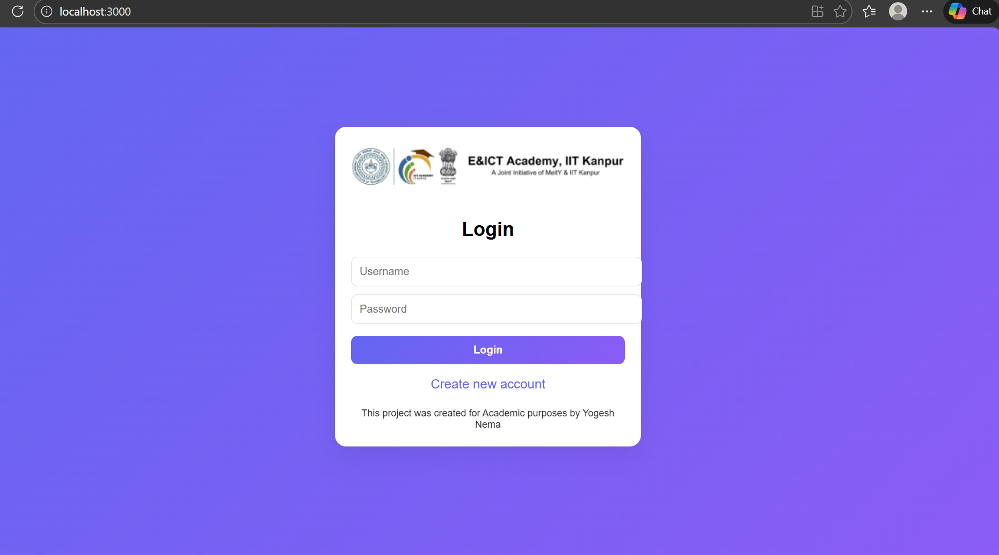
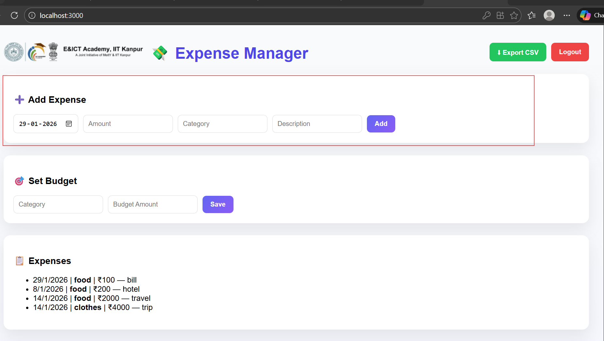
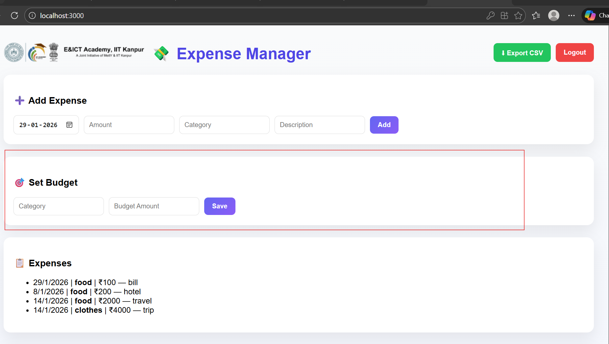
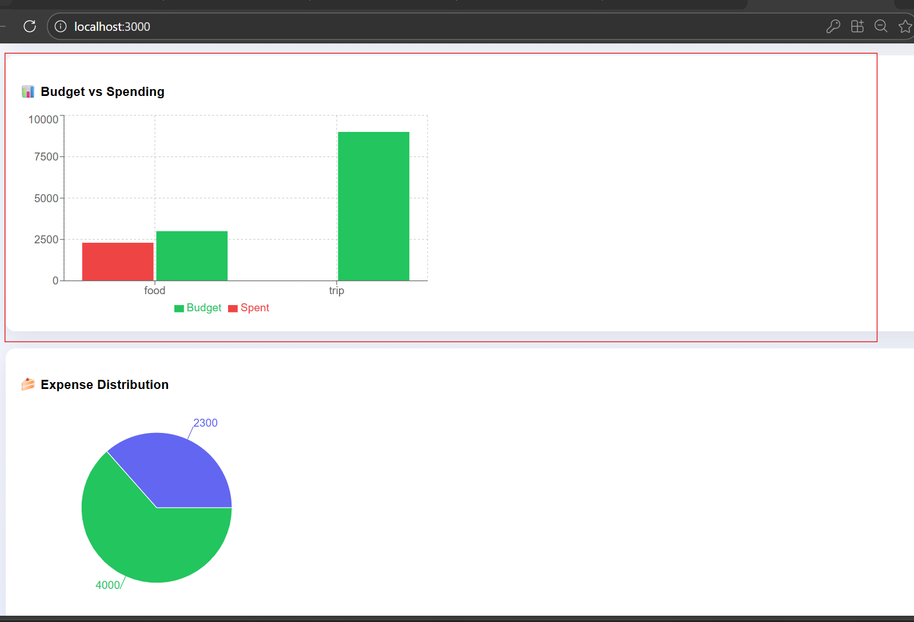
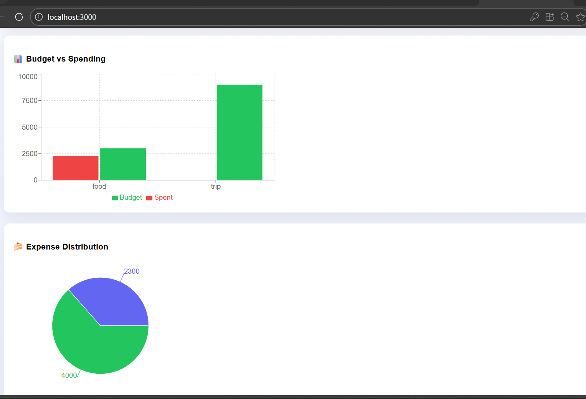

# 📊 Expense Tracker — Full Stack (FastAPI + React + SQLite)

A full-stack multi-user Expense Tracker application built for academic purposes.  
Users can register, login, record expenses with dates, set budgets per category, and view spending analytics using charts.

---

# 🚀 Features

- 🔐 User Registration & Login (JWT Authentication)
- 👤 Multi-user data isolation
- 💰 Add expenses with:
  - Date (YYYY-MM-DD)
  - Category
  - Amount
  - Description
- 📅 Expense date tracking
- 🗂 Category-wise budgets
- 📈 Charts & analytics dashboard
- 🗄 SQLite database storage
- ⚡ FastAPI async backend
- 🎨 React frontend with charts

---

# 🏗️ Architecture Overview


React Frontend  (Port 3000)
        │
        │  HTTP + JWT Token
        ▼
FastAPI Backend (Port 8000)
        │
        │  Async DB access
        ▼
SQLite Database (database.db)


---

# 🖥️ Frontend Stack

- React
- Axios
- Recharts (Bar & Pie charts)
- JWT token storage in localStorage
- Form-based UI
- Centered login screen
- Budget + expense dashboards

## Frontend Responsibilities

- User login/register
- Token storage
- Expense entry forms
- Budget forms
- Charts rendering
- API calls to backend

---

# ⚙️ Backend Stack

- FastAPI
- SQLite
- SQLAlchemy Core
- Databases (async)
- JWT Authentication
- Passlib password hashing
- Pydantic models

## Backend Responsibilities

- User authentication
- Expense storage
- Budget storage
- Summary calculations
- JWT validation
- Multi-user separation

---

# 🗄️ Database Schema

## Users Table

| Column | Type |
|--------|--------|
| id | Integer |
| username | String |
| hashed_password | String |

---

## Expenses Table

| Column | Type |
|--------|--------|
| id | Integer |
| user_id | FK |
| date | Date |
| category | String |
| amount | Float |
| description | String |

---

## Budgets Table

| Column | Type |
|--------|--------|
| id | Integer |
| user_id | FK |
| category | String |
| budget | Float |

Unique constraint: `(user_id, category)`

---

# 🔐 Authentication Flow

1. User registers or logs in
2. Backend verifies credentials
3. JWT token is issued
4. Frontend stores token
5. Token sent in headers:


Authorization: Bearer <token>


6. Backend validates token on each request

---

# 📡 API Endpoints

## Auth

### Register


POST /register


Body:

```json
{
  "username": "user",
  "password": "pass"
}


# 📸 Screenshots

## 🔐 Login / Register Page


---

## 💰 Add Expense Form


---

## 📊 Dashboard — Expenses & Budgets


---

## 📈 Charts View


---

## 🗂 Budget Summary



Login

POST /login


Returns JWT token.

Expenses

Add Expense

POST /expenses

{
  "date": "2026-01-29",
  "category": "Food",
  "amount": 250,
  "description": "Lunch"
}

Get Expenses
GET /expenses


Returns current user expenses.

Budget
Set Budget
POST /budget

{
  "category": "Food",
  "budget": 5000
}

Summary
Category Summary
GET /summary


Returns:

[
  {
    category,
    budget,
    spent,
    remaining
  }
]

📊 Charts

Frontend uses:

Pie chart — category spending

Bar chart — budget vs spent

Data source: /summary

🌐 CORS Config

Backend allows:

http://localhost:3000


Configured in FastAPI middleware.

🚀 Future Improvements (Suggested)

Edit/Delete expenses

Monthly filters

Export to CSV

Admin user role

Password reset

Cloud DB (Postgres)

Docker deployment

User profile page

👨‍💻 Author

Created for academic and learning purposes.

Yogesh Nema